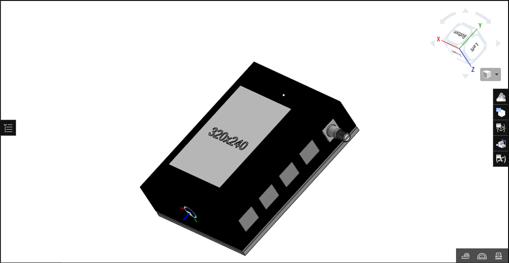
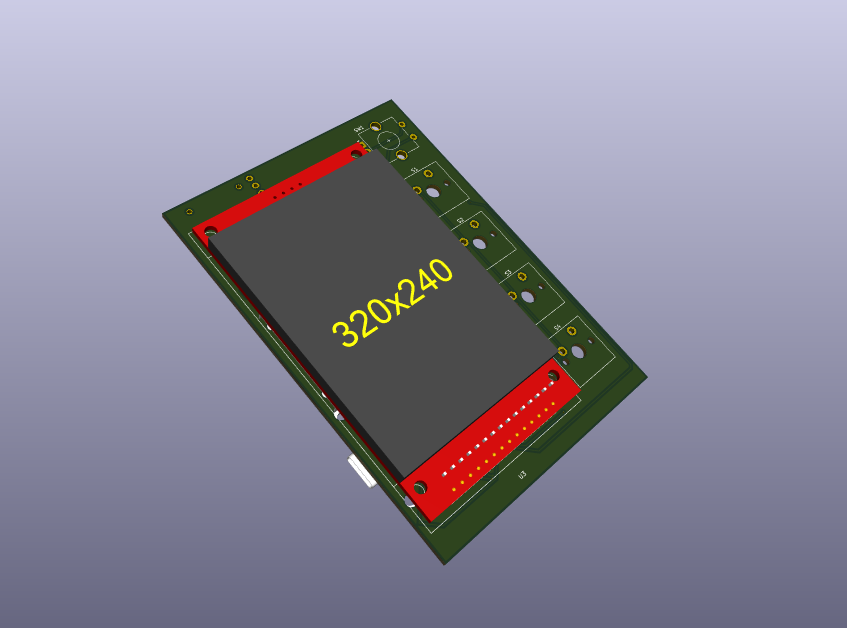
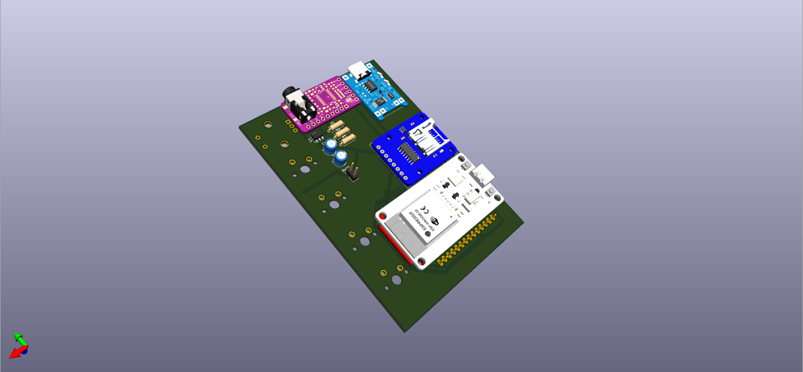
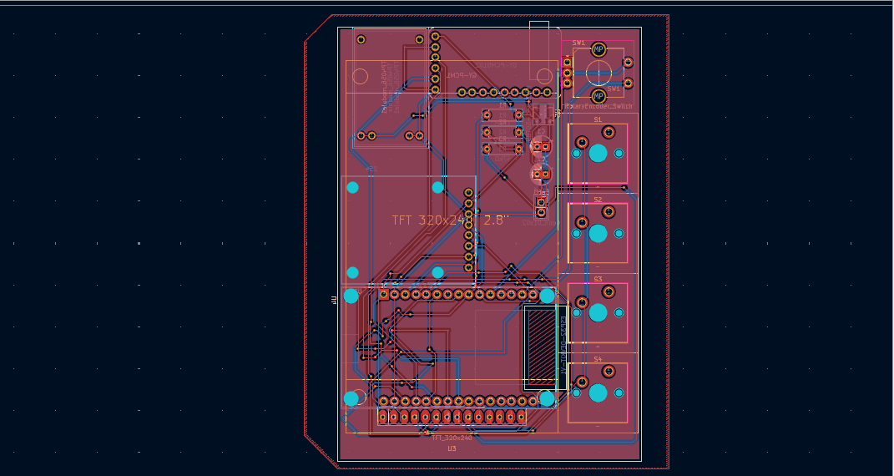
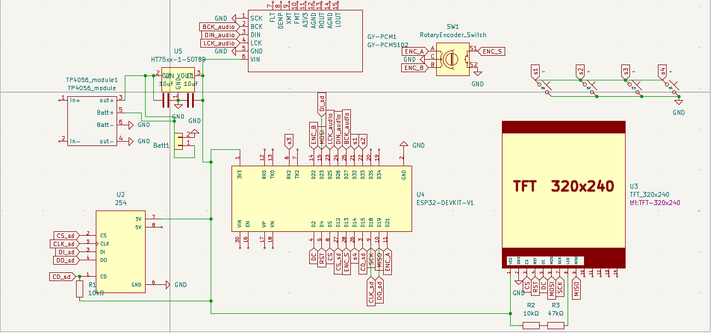

# dB-1

An MP3 player inspired by the Sony  Walkman.Featuring custom UI interactive navigation and minimalism.Bluethooth commectivity and wifi support along with customizable settings. A crush for music lovers

# Images

# Features

-Bluetooh connectivity 

-Wifi integratad

-Long battery life with 2380mah Battery

-Argonomic design

-Rotary encoded volum controll

-4 button navigation

-2.8"   didplay

-Cherry mx switches for fidgety feel

-Custom designed UI

-Unlimited storage(depends on your SD card)

-Programmabe environment

Note: All of the schematic symbols and footprints are not available in KIcad
# BOM

| Name | Purpose | Quantity | Total Cost | Link | Distributor |
| :--- | :--- | :--- | :--- | :--- | :--- |
| **Enclosure** | Casing | 1 | 13 | [Link](https://so) | @Souptik Samanta |
| **PCB** | Circuit board | 5 | 11.3 | [Link](https://jlc) | Aliexpress |
| **Li-Ion Battery** | Powering | 1 | 13.6 | [Link](https://wv) | Aliexpress |
| **47k ohm resistor** | Voltage limit | 1 | 1.47 | [Link](https://wv) | Aliexpress |
| **10k ohm resistor** | Voltage reg | 2 | 1.47 | [Link](https://wv) | Aliexpress |
| **10uf Capacitor** | Voltage reg | 2 | 0.93 | [Link](https://wv) | Aliexpress |
| **HT7533 Regulator** | Power reg | 1 | 1.84 | [Link](https://wv) | Liexpress |
| **Cherry MX Switches** | Navigation | 10 | 9.51 | [Link](https://wv) | Aliexpress |
| **Micro SD card** | Micro SD slot | 1 | 9.57 | [Link](https://wv) | Aliexpress |
| **EC-11 Rotary** | Volume control | 1 | 4.33 | [Link](https://wv) | Aliexpress |
| **2.8 Inch Screen** | Display | 1 | 9.99 | [Link](https://wv) | Aliexpress |
| **TP4056 Charger** | Battery charger | 1 | 3.55 | [Link](https://wv) | Aliexpress |
| **GY-PCM5102** | Audio driver | 1 | 5.35 | [Link](https://wv) | Aliexpress |
| **ESP32-WROOM** | MCU | 1 | 7.72 | [Link](https://wv) | Aliexpress |

Made by Rubaiyat_Islam

